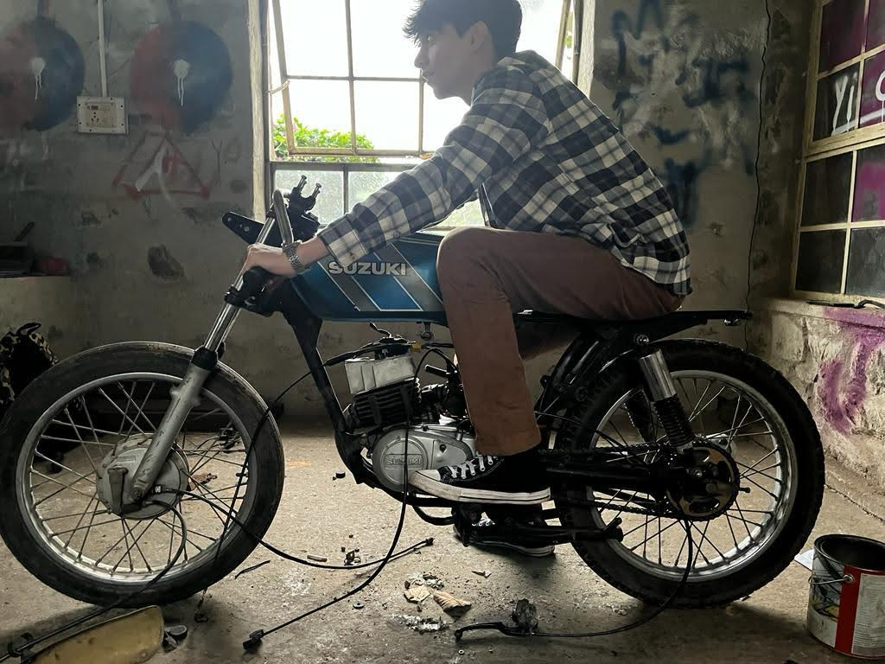
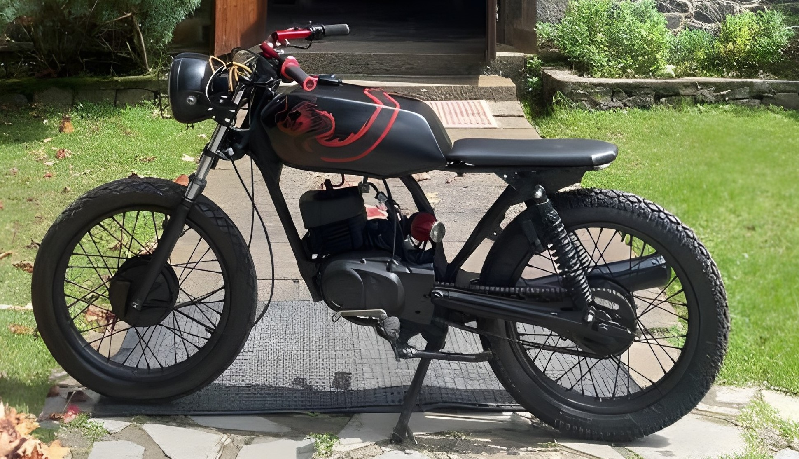

<h1 align="center">
  Paz Mogrelia
</h1>

<div align="center">

[About Me](#about-me) · [My Projects](#my-projects) · [My Interests](#my-interests)  

</div>

```
#greet.py

def greet():
    print('"Welcome to Paz Mogrelia's site."')

greet()
```
> **Output:** <br>
> $ python greet.py <br>
> "Welcome to Paz Mogrelia's site."
> 

### About Me

I am Paz Mogrelia, a Computer Science major at the University of California, San Diego.

<div align="center">

  
(that's me.)<br>
[Email](mailto:pmogrelia@ucsd.edu) | [LinkedIn](http://linkedin.com/in/pazmogrelia) | [Resume](./resume.jpg)  | [GitHub](https://github.com/pmogrelia)

</div>


I am passionate about software engineering and have hands-on experience through internships and projects. My favourite experience has been working at the Mechanical and Aerospace Engineering Department at UCSD, where I manage and set-up all online course systems using MATLAB and Google Apps Scripts until 2030. I also oversee the maintenance of the [central course site](https://mae156b.ucsd.edu/), fixing issues dating back to 2014.

Apart from job work, I am an avid gamer and game developer. My best releases were a platformer video game, BitRunner, using Unity in C# and Google Firebase for my IB Computer Science HL Assessment and my co-developed indie game called Worst Tanks. I am also passionate about working on and learning about cybersecurity and AI/ML projects.

When I'm not coding, I enjoy playing chess, working on motorcycle projects (still don't have my licence yet), and collecting vinyls; though my collection definetly needs some work.


### My Projects  

#### Video Games  

1. **BitRunner**: A platformer video game created for the IB Computer Science HL Assessment. It features user logins and leaderboards, developed using the Unity game engine with C# and integrated with Google Firebase. 
> (Code available at request)  
2. **Worst Tanks**: Co-developed a small indie game for Weekly Game Jam 150 on Itch.io. I was responsible for programming the game in C#. 
> All itch.io games can be found [here](https://brrrrrr.itch.io/). 

---

#### Data Analytics (Currently Working On)  
- **Comparative Analysis of Lamine Yamal and Young Messi**: A data analytics project developed for Eclipse Analytics at UCSD. This project involves analyzing and comparing the early career statistics and performance metrics of Lamine Yamal and Lionel Messi using AI generated performance indicators. The analysis was conducted using statistical methods and visualizations to highlight similarities and differences. 
>You can explore more about the project once completed at [Eclipse Analytics](https://eclipseanalytics.org).  

---

#### Productivity and Utility Applications  
- **Online Meeting Productivity Checker**: An application created using Python and the Tkinter library to track productivity during online meetings. Developed as a part of the MYP Personal Project. 
> (Code available at request)  
  
### My Interests  
 
Some of the tech fields that intrest me the most are **cybersecurity** and **AI/ML projects**. Exploring these fields keeps me on my toes, and I’m always looking for interesting projects to dive into.  

When I'm not coding, I’m usually up to something else that keeps me busy. I love playing chess – it’s a great way to test my brainpower (I'm only 1200 rated). I’m also into motorcycles, I modified and customized one during High School – even though I still don’t have my license yet. You can check out a before and after picture of my first project bike below:  

    
> More photos are on our [Instagram](https://www.instagram.com/cafecustoms23/)
> 
I’m also trying to build up a vinyl collection, but i'll be honest – it’s still pretty small. 
>You can see what I’ve got so far on my [Discogs Profile](https://www.discogs.com/user/pmogrelia/collection).  

I’m a big sports fan too. I spent some time living in Amsterdam, so I support Ajax. In football (soccer), I also a support Tottenham Hotspur (yeah, it’s not always easy). In F1, I cheer for Red Bull Racing and, of course specifically, Max Verstappen. When it comes to basketball, I’m all about the Lakers. 

I don't just watch the sports, I love to get outside and play too, whether its go-karting, pickup games or taking a nice hike. 
 

### What's next for me?

- [x] Submit my CSE 110 Lab 1
- [ ] Land a summer internship
- [ ] Finish Data Analytics Project
- [ ] Find a new cyber or AI/ML project
- [ ] Get my licence
